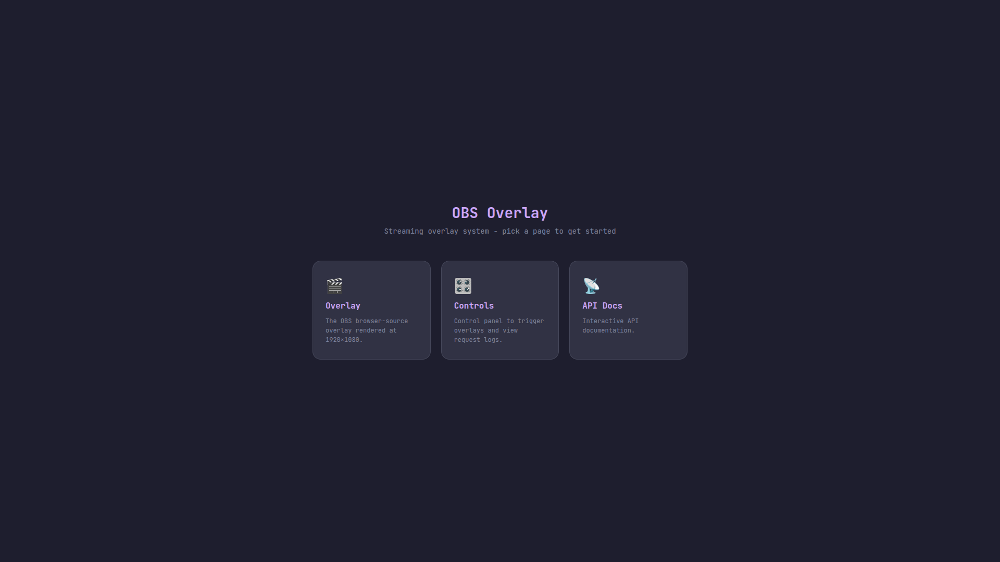
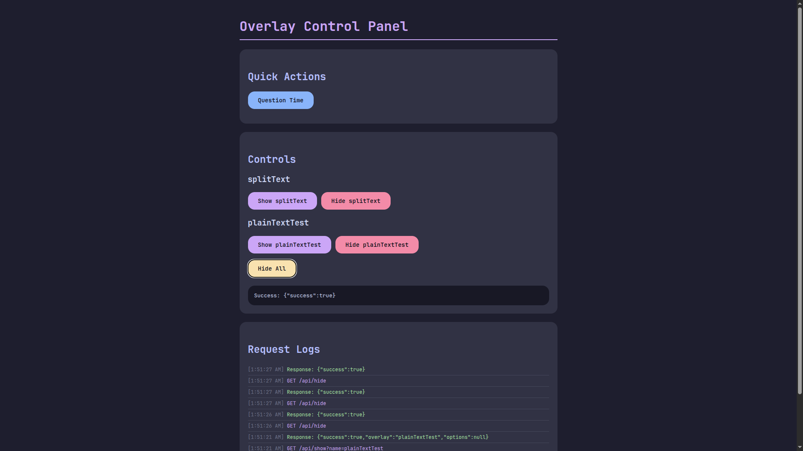
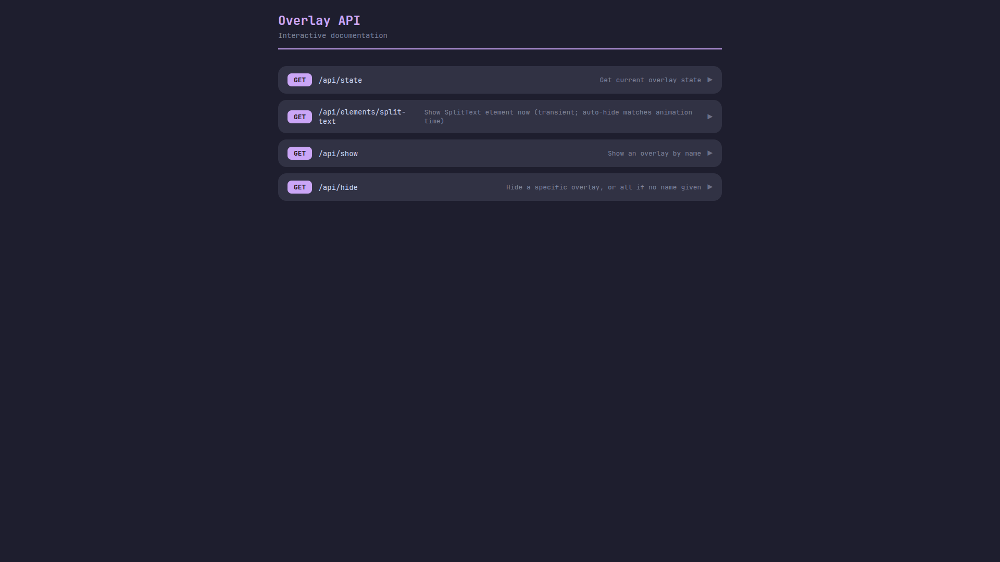

# OBS overlays

these are my obs overlays

I don't stream but I think this is nice to have just in case

this is my first time using GSAP btw

## routes

- `/overlay/`
- `/controls/`
- `/api/`

## screenshots

## TODO (not in specific order)

- [ ] add scenes (`/overlay/break`, `/overlay/something`)
- [ ] add persistent config (per scene)
- [ ] twitch chat (element)
- [ ] animated svg src (element) (local/internet)
- [ ] add auth token
- [ ] generic `size`, `position`, `rotation` per element
- [ ] add `element-id` in show endpoint to support multiple instances of same
      element, and to be able to edit live elements
- [ ] more elements
- [ ] customizable ctl-panel (custom quick actions)
